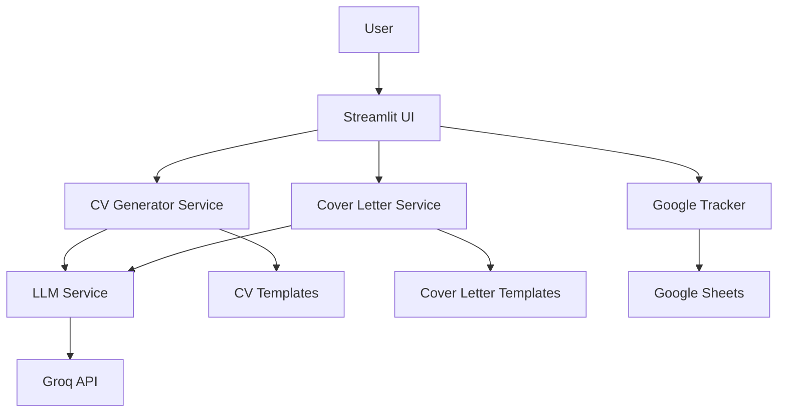
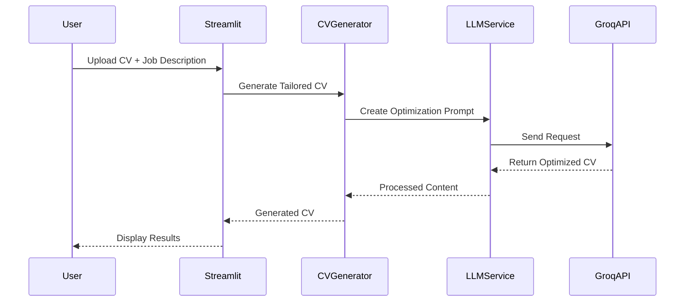
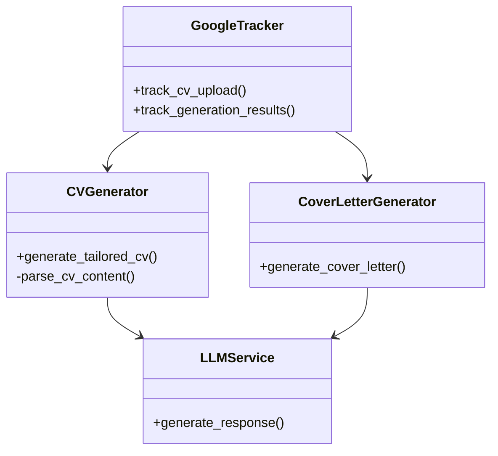
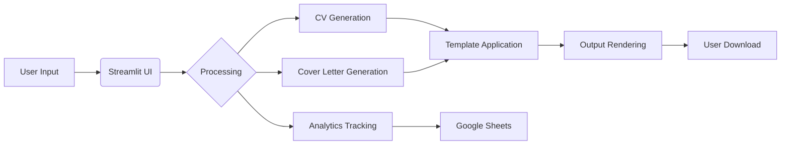

# CV Generator Architecture Documentation

## System Architecture Overview

## Document Generation Sequence

## Component Relationships

## Data Flow Graph

## Key Architecture Papers
1. **AI-Powered Document Generation** - Explains the prompt engineering and optimization techniques
2. **Streamlit Architecture Patterns** - Details the UI component design
3. **LLM Integration Best Practices** - Covers efficient API usage and error handling
4. **Template System Design** - Documents the template engine implementation

All diagrams are available in Mermaid format for easy modification. You can view them directly on GitHub or import into Mermaid-compatible tools.